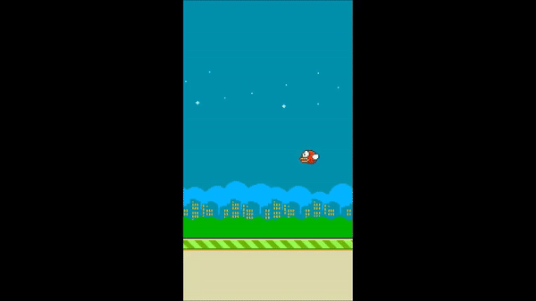
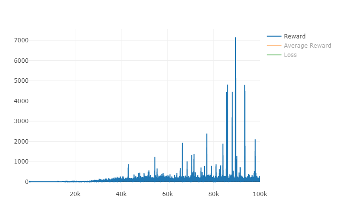
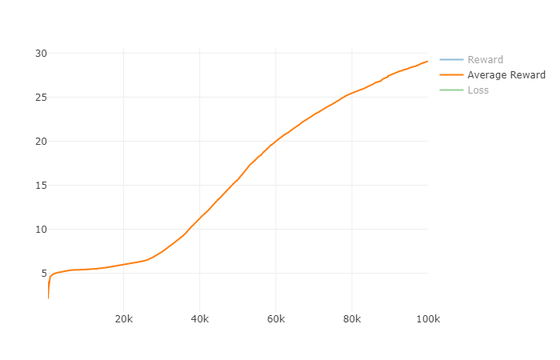

# Double Deep Q Learning (DDQN) In PyTorch
DDQN inplementation on PLE FlappyBird environment in PyTorch.  
  
  
  
**DDQN** is proposed to solve the overestimation issue of Deep Q Learning (DQN). Apply separate target network to choose action, reducing the correlation of action selection and value evaluation. 

## Requirement
* Python 3.6
* Pytorch
* Visdom
* [PLE (PyGame-Learning-Environment)](https://github.com/ntasfi/PyGame-Learning-Environment) 
* Moviepy

## Algorithm

  
* In this implementation, I update policy network per episode e not per step t.
* Simplify input images for faster convergence.

   
## Usage
* HyperParameter in `config.py`
* Train 
 ```
 python main.py --train=True --video_path=./video --logs_path=./logs 
 ```
* Restore Pretrain Model
 ```
 python main.py --restore=./pretrain/model-98500.pth  
 ```
* Visualize loss and reward curve
```
python -m visdom.server
python visualize.py --logs_path=./logs
```
 
## Result 
* [Full Video (with 60 FPS)](https://www.youtube.com/watch?v=GCHTadB22P8&feature=youtu.be)
* Reward  

  
## Reference
* [Deep Reinforcement Learning with Double Q-learning](https://arxiv.org/abs/1509.06461)
* [CS 294: Deep Reinforcement Learning](http://rll.berkeley.edu/deeprlcourse/)
* [DeepLearningFlappyBird](https://github.com/yenchenlin/DeepLearningFlappyBird)
* [DQN and Policy Network](https://nthu-datalab.github.io/ml/labs/17_DQN_Policy_Network/17-DQN_&_Policy_Network.html)  
